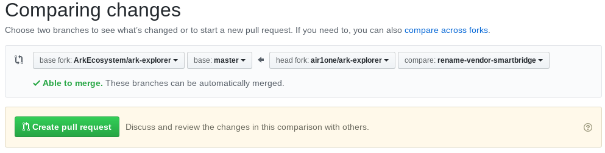

# How to contribute to the Ark project

## Introduction

Hello there ! Thinking about contributing to the Ark Ecosystem ? You're in the right place.

Everyone is welcome to contribute with his own set of skills. Don't worry of you're not a crypto specialist or a developer : we can always find something for you 😉

This guide will first detail the current bounty programs, then help you get started so you can contribute right away. So let's go !

## Bounty programs

### Pull request

Every pull request you submit and is accepted will be rewarded.

#### Amount 
$10 for each accepted pull request.

#### Accepted types of PR
-   Refactoring
-   Tests
-   Bug fixes
-   New features
-   Documentation
-   Translations or typos (but will be rewarded only once per month)

If you want to implement a new feature, **please first ask the team** : you can create an issue in GitHub or join the [Slack channel](https://ark.io/slack) to talk about it. It will save you time if the feature could not be accepted as is.

#### Eligible repositories 
-   [ark-mobile](https://github.com/ArkEcosystem/ark-mobile)
-   [ark-desktop](https://github.com/ArkEcosystem/ark-desktop)
-   [ark-rpc](https://github.com/ArkEcosystem/ark-rpc)
-   [ark-deployer](https://github.com/ArkEcosystem/ark-deployer)
-   [ark-qrcode](https://github.com/ArkEcosystem/ark-qrcode)
-   [ark-js](https://github.com/ArkEcosystem/ark-js)
-   [ark-kotlin](https://github.com/ArkEcosystem/ark-kotlin)
-   [arky](https://github.com/ArkEcosystem/arky)
-   [ark-java](https://github.com/ArkEcosystem/ark-java)
-   [ark-explorer](https://github.com/ArkEcosystem/ark-explorer)
-   [ark-client](https://github.com/ArkEcosystem/ark-client)
-   [ark-node](https://github.com/ArkEcosystem/ark-node)
-   [ark-lite-wallet](https://github.com/ArkEcosystem/ark-lite-wallet)
-   [ark-net](https://github.com/ArkEcosystem/ark-net)
-   [ark-paperwallet](https://github.com/ArkEcosystem/ark-paperwallet)
-   [ARKcommander](https://github.com/ArkEcosystem/ARKcommander)
-   [ark-ts](https://github.com/ArkEcosystem/ark-ts)
-   [ark-ios-monitor](https://github.com/ArkEcosystem/ark-ios-monitor)
-   [ark-go](https://github.com/ArkEcosystem/ark-go)
-   [ark-ledger](https://github.com/ArkEcosystem/ark-ledger)
-   [nucleid](https://github.com/ArkEcosystem/nucleid)

#### Examples
- You got 3 accepted translation PRs in a month, you will get $10
- You got 3 accepted bug fix PRs and 1 translation PR, you will get $40

### Monthly bounties

At the end of each month, the month's top contributors will be rewarded.

#### Amount
- $2000 for 1st place
- $1500 for 2nd
- $1000 for 3rd
- $250 for 4 to 6th
- $50 for the other contributors

#### Conditions
- Have at least 1 merged PR in the month (only accepted and merged PRs count, pending PRs do not)

#### Examples
- You got 2 merged PRs in the month, 1 is a bug fix and 1 is a typo. You have been selected for the 5th place for the month : you will get $250, in addition to your $20 for your 2 merged PRs.

### Security bounty

The security bounty rewards you for finding bugs or errors in the core code (ark-node) that could lead to security issues.

#### Amount (depends on the criticity)
- Low : $200
- Medium : $1000
- Critical : $2000
- Doomsday : custom - contact the team

You will also get an additional 50% if you provide a fix for the vulnerability you found.

#### Conditions
- Never disclose any exploit or vulnerability
- Never maliciously initiate an exploit on the main network
- Send an in-depth explanation mail to security@ark.io with steps to reproduce

### Documentation bounty

The documentation bounty rewards you for contributing to the ArkEcosystem [docs repository](https://github.com/ArkEcosystem/docs).

#### Amount
- $10 to $30 per 100 written words, depending on the complexity and quality of the writing

#### Conditions :
- Write in English
- Follow the workflow described in "how to get started - Documentation"
- Don't plagiarize : we take this seriously. It could get you excluded from participating in this or others bounties.

### Custom projects

If you didn't find something for you, but you have another idea, get in contact with **boldninja** on Slack to talk about it.

It can be (almost) anything : from an Ark-related app to a Ark design project or educational video... Your imagination is the limit !

If your project is accepted, you will get a funding so that you can work on it.

## How to get started

### Development

So you want to start contributing to the ArkEcosystem repositories. You must have favorites programming languages / frameworks : go to the [ArkEcosystem](https://github.com/ArkEcosystem) organization page and browse the repositories looking for the one(s) that fits you.

Now that you have chosen one or more repos, here is what you can do to get started :
- Check the open issues. If you find something you would be comfortable developing, go for it. If not :
- Set up your development environment, and start using the product : go through the use cases, test it. You might find a bug or something you can improve.
- You can also check the closed issues to see what's been done : it can give you some ideas on what to do next.

When you've found something to work on, check and follow the GitHub workflow (link).

### Documentation

The documentation topics are organized in the Github [project page](https://github.com/ArkEcosystem/docs/projects/1) : you can go there and check the ones that are in status "Open".

If there's one topic you want to write, contact **boldninja** on [Slack](https://ark.io/slack) and ask him if you can take it. If you have examples of things you wrote (a blog, a doc on GitHub, ...), send it to him.

When you have confirmation that you can work on a subject, you can start and follow the GitHub workflow (link).

Remember that quality is key if you want to get your writing approved.

## Github workflow

To go through this workflow, you must have a GitHub account. You must also have Git installed on your computer.

### Fork the repository

To fork the repository, go to its GitHub page and click on the "Fork" button that is in the upper right :

It should take a few seconds for your fork to be ready !

So now you have your own repository you can work on.

### Git clone to get the files locally

To get your local copy of your repository, you have to run the Git clone command :

    git clone https://github.com/<your-username>/<your-repo>.git
    
   This will get you the files from the repository in a local folder.

### Work locally and push changes to your repo

Now you can work, create and modify files. Once you're satisfied with your changes you can commit :

    git commit -m "This is my awesome commit !"

And push your changes :

    git push

### Submit your changes : PR request

Before you make a PR request, please (if applicable) check that :
- Tests are passing : run `yarn test`
- The code follows the coding standards : run `yarn lint`

Finally, to submit your PR, go to the Ark repository on GitHub.

GitHub might auto detect that you want to create a pull request and suggest it to you :

If not you can do it manually : go to the "Pull requests" tab and click on the "New pull request" button.

You will then be able to compare your changes between the Ark master branch and your own branch (click on the link "compare accross forks").

If you're satisfied with the changes, then you can add a clear title and description to your PR and submit it !

### Additional tips

#### Keep your fork synced

The Ark repositories are updated on a regular basis with new PRs. So you need to keep your fork synced in order to have the latest changes.

To do that, please follow this Github doc : [Syncing a fork](https://help.github.com/articles/syncing-a-fork/).

## Conclusion

Now you're up and ready to contribute to the Ark repositories !

If you have any doubt or questions, talk about it in the [Slack](https://ark.io/slack) channels. There are always people ready to help you.

Welcome to the Ark Ecosystem, and have fun contributing 😀
