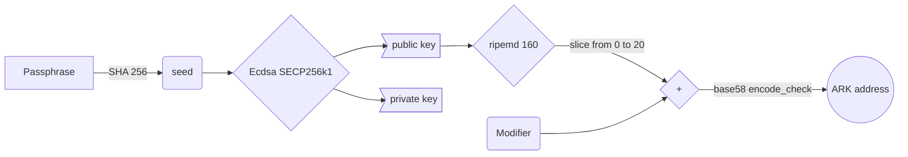

# What is ARK address

## Foreword

Blockchain is a database where records are stored after a concensus processed by node network. The unit record used in this process is a peer to peer transaction containing informations such as `vendorField`, `asset`, `amount` and `fee`. Because it is peer to peer, accounts need to be identified and there comes the ARK addresses.

## All is about passphrase

## Schematic diagram

## ARK are stored on address

## Dive more

## FAQ

