# All you want to know about ARK address

## Foreword

Blockchain is a database where records are stored after a concensus processed by network nodes. The unitary element used in this process is a peer to peer transaction containing informations such as `vendorField`, `asset`, `amount` and `fee`. Because it is peer to peer, account needs to be identified and here comes the ARK address.

**Cryptography**

ARK uses SECP256k1 curve from [eliptic curve digital signature algorithm](https://en.wikipedia.org/wiki/Elliptic_Curve_Digital_Signature_Algorithm).

An account is defined by the possibility to sign data using a private key and to provide a public key letting everyone check signature issued with the private key. It is a proof of ownership.

In ARK, transaction have to be signed before broadcast. ECDSA generates [private key/public key] pair from a unique 32-bytes `seed`. This `seed` is not something easy to handle so it is generated from something more human : the `passphrase`.

**Passphrase**

Passphrase is a simple text. The more complex it is, the more it secures the account. In blockchain, passphrase are generaly made of twelve words according to [BIP39](https://github.com/bitcoin/bips/blob/master/bip-0039.mediawiki). It is not mandatory since a `seed` can be generated from one single char...

```python
>>> import hashlib
>>> # seed generated from a single char
>>> hashlib.sha256("a".encode("utf-8")).hexdigest()
'ca978112ca1bbdcafac231b39a23dc4da786eff8147c4e72b9807785afee48bb'
>>> # seed generated from a simple passphrase
>>> hashlib.sha256("a stronger passphrase".encode("utf-8")).hexdigest()
'1be075706dd9f09c91b8506701ef88cac64b5c6a307b9b7ec83790bd8f2be130'
```

## ARK address

An address can store amount of ARK, it is a proof of existence in the blockchain. 

### How it is generated

Ark address is derived from the `passphrase` trough a complex flow:

```mermaid
graph LR

    P(passphrase) --> S{SHA 256}
    S -- seed --> T{<center>ECDSA<br/>SECP256k1</center>}
    T --> P1>private key]
    T --> P2>public key]
    R --> X{"slice(0,20)"}
    X --> O{+}
    M(modifier) --> O
    O --> B{<center>BASE58<br/>enc_chk</center>}
    B --> A("&#1126;ddress")
    P2 --> R{RIPEMD 160}

style M fill:#ccf,stroke:#66f,stroke-width:6px
style P fill:#ccf,stroke:#66f,stroke-width:6px
style A fill:#fcc,stroke:#f66,stroke-width:6px
```



As we can see on the chart above, it is impossible to find `passphrase` from `ARK address`, even with brute force computation, because of the `slice` applied during the flow. `modifier` is a byte used to customize the address. It is usefull to diferenciate developpement network addresses from main network ones.

<table>
<tr><th>hex</th><th>start with</th><th>hex</th><th>start with</th><th>hex</th><th>start with</th><th>hex</th><th>start with</th><th>hex</th><th>start with</th></tr>
<tr><td>00</td><td>1</td>     <td>10</td><td>7</td>     <td>20</td><td>D or E</td><td>30</td><td>L</td>     <td>40</td><td>S or T</td></tr>
<tr><td>01</td><td>Q or o</td><td>11</td><td>7 or 8</td><td>21</td><td>E</td>     <td>31</td><td>L or M</td><td>41</td><td>T</td></tr>
<tr><td>02</td><td>o or 2</td><td>12</td><td>8</td>     <td>22</td><td>E or F</td><td>32</td><td>M</td>     <td>42</td><td>T</td></tr>
<tr><td>03</td><td>2</td>     <td>13</td><td>8 or 9</td><td>23</td><td>F</td>     <td>33</td><td>M</td>     <td>43</td><td>T or U</td></tr>
<tr><td>04</td><td>2 or 3</td><td>14</td><td>9</td>     <td>24</td><td>F</td>     <td>34</td><td>M or N</td><td>44</td><td>U</td></tr>
<tr><td>05</td><td>3</td>     <td>15</td><td>9</td>     <td>25</td><td>F or G</td><td>35</td><td>N</td>     <td>45</td><td>U or V</td></tr>
<tr><td>06</td><td>3</td>     <td>16</td><td>9 or A</td><td>26</td><td>G</td>     <td>36</td><td>N or P</td><td>46</td><td>V</td></tr>
<tr><td>07</td><td>3 or 4</td><td>17</td><td>A</td>     <td>27</td><td>G or H</td><td>37</td><td>P</td>     <td>47</td><td>V</td></tr>
<tr><td>08</td><td>4</td>     <td>18</td><td>A or B</td><td>28</td><td>H</td>     <td>38</td><td>P</td>     <td>48</td><td>V or W</td></tr>
<tr><td>09</td><td>4 or 5</td><td>19</td><td>B</td>     <td>29</td><td>H</td>     <td>39</td><td>P or Q</td><td>49</td><td>W</td></tr>
<tr><td>0a</td><td>5</td>     <td>1a</td><td>B</td>     <td>2a</td><td>H or J</td><td>3a</td><td>Q</td>     <td>4a</td><td>W or X</td></tr>
<tr><td>0b</td><td>5</td>     <td>1b</td><td>B or C</td><td>2b</td><td>J</td>     <td>3b</td><td>Q or R</td><td>4b</td><td>X</td></tr>
<tr><td>0c</td><td>5 or 6</td><td>1c</td><td>C</td>     <td>2c</td><td>J or K</td><td>3c</td><td>R</td>     <td>4c</td><td>X</td></tr>
<tr><td>0d</td><td>6</td>     <td>1d</td><td>C or D</td><td>2d</td><td>K</td>     <td>3d</td><td>R</td>     <td>4d</td><td>X or Y</td></tr>
<tr><td>0e</td><td>6 or 7</td><td>1e</td><td>D</td>     <td>2e</td><td>K</td>     <td>3e</td><td>R or S</td><td>4e</td><td>Y</td></tr>
<tr><td>0f</td><td>7</td>     <td>1f</td><td>D</td>     <td>2f</td><td>K or L</td><td>3f</td><td>S</td>     <td>4f</td><td>Y or Z</td></tr>
</table>

<table>
<tr><th>hex</th><th>start with</th><th>hex</th><th>start with</th><th>hex</th><th>start with</th><th>hex</th><th>start with</th><th>hex</th><th>start with</th></tr>
<tr><td>50</td><td>Z</td>     <td>60</td><td>f or g</td><td>70</td><td>n</td>     <td>80</td><td>t</td>     <td>90</td><td>z or 2</td></tr>
<tr><td>51</td><td>Z</td>     <td>61</td><td>g</td>     <td>71</td><td>n</td>     <td>81</td><td>t or u</td><td>91</td><td>2</td></tr>
<tr><td>52</td><td>Z or a</td><td>62</td><td>g</td>     <td>72</td><td>n or o</td><td>82</td><td>u</td>     <td>92</td><td>2</td></tr>
<tr><td>53</td><td>a</td>     <td>63</td><td>g or h</td><td>73</td><td>o</td>     <td>83</td><td>u or v</td><td>93</td><td>2</td></tr>
<tr><td>54</td><td>a or b</td><td>64</td><td>h</td>     <td>74</td><td>o or p</td><td>84</td><td>v</td>     <td>94</td><td>2</td></tr>
<tr><td>55</td><td>b</td>     <td>65</td><td>h or i</td><td>75</td><td>p</td>     <td>85</td><td>v</td>     <td>95</td><td>2</td></tr>
<tr><td>56</td><td>b or c</td><td>66</td><td>i</td>     <td>76</td><td>p</td>     <td>86</td><td>v or w</td><td>96</td><td>2</td></tr>
<tr><td>57</td><td>c</td>     <td>67</td><td>i</td>     <td>77</td><td>p or q</td><td>87</td><td>w</td>     <td>97</td><td>2</td></tr>
<tr><td>58</td><td>c</td>     <td>68</td><td>i or j</td><td>78</td><td>q</td>     <td>88</td><td>w or x</td><td>98</td><td>2</td></tr>
<tr><td>59</td><td>c or d</td><td>69</td><td>j</td>     <td>79</td><td>q or r</td><td>89</td><td>x</td>     <td>99</td><td>2</td></tr>
<tr><td>5a</td><td>d</td>     <td>6a</td><td>j or k</td><td>7a</td><td>r</td>     <td>8a</td><td>x</td>     <td>9a</td><td>2</td></tr>
<tr><td>5b</td><td>d or e</td><td>6b</td><td>k</td>     <td>7b</td><td>r</td>     <td>8b</td><td>x or y</td><td>9b</td><td>2</td></tr>
<tr><td>5c</td><td>e</td>     <td>6c</td><td>k</td>     <td>7c</td><td>r or s</td><td>8c</td><td>y</td>     <td>9c</td><td>2</td></tr>
<tr><td>5d</td><td>e</td>     <td>6d</td><td>k or m</td><td>7d</td><td>s</td>     <td>8d</td><td>y or z</td><td>9d</td><td>2</td></tr>
<tr><td>5e</td><td>e or f</td><td>6e</td><td>m</td>     <td>7e</td><td>s or t</td><td>8e</td><td>z</td>     <td>9e</td><td>2</td></tr>
<tr><td>5f</td><td>f</td>     <td>6f</td><td>m or n</td><td>7f</td><td>t</td>     <td>8f</td><td>z</td>     <td>9f</td><td>...</td></tr>
</table>

## Dive more

## FAQ

