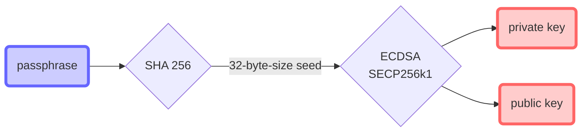
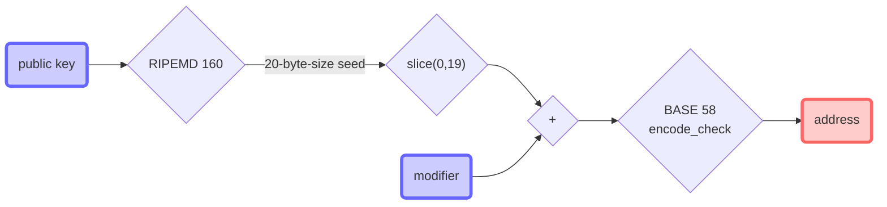

**From passphrase to private and public keys**

```mermaid
graph LR
    P(passphrase) --> S{SHA 256}
    S -- "32-byte-size seed" --> T{<center>ECDSA<br/>SECP256k1</center>}
    T --> P1(private key)
    T --> P2(public key)
style P fill:#ccf,stroke:#66f,stroke-width:4px
style P1 fill:#fcc,stroke:#f66,stroke-width:4px
style P2 fill:#fcc,stroke:#f66,stroke-width:4px
```
**From public key to address**

```mermaid
graph LR
    P2(public key) --> R{RIPEMD 160}
    R -- "20-byte-size seed" --> X{"slice(0,19)"}
    X --> O{+}
    M(modifier) --> O
    O --> B{<center>BASE 58<br/>encode_check</center>}
    B --> A(<center>address<center>)
style M fill:#ccf,stroke:#66f,stroke-width:4px
style P2 fill:#ccf,stroke:#66f,stroke-width:4px
style A fill:#fcc,stroke:#f66,stroke-width:4px
```
