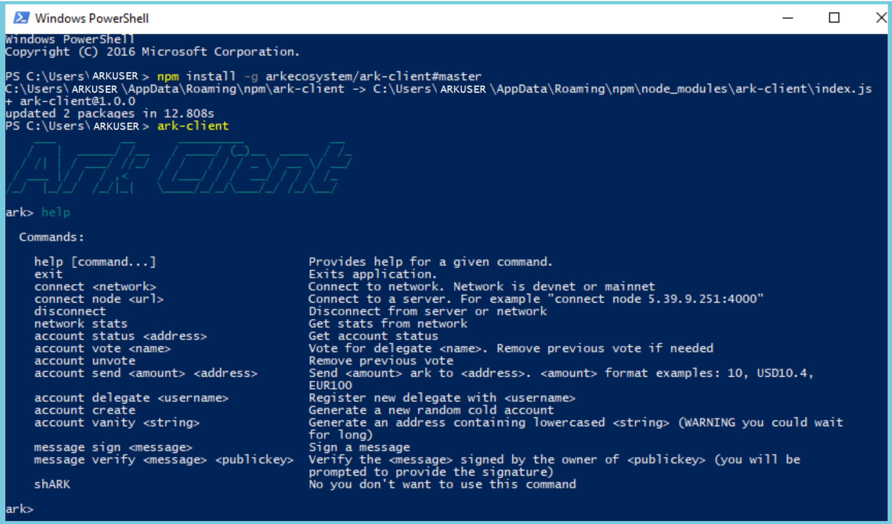
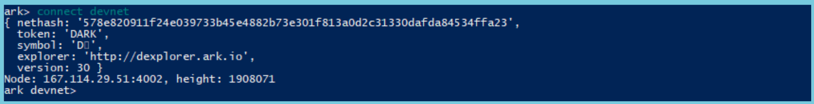

# Using the ARK CLI Client

Some users may wish to interact with the ARK blockchain directly and not through the desktop or mobile client.

The Ark-client is available for users running windows, Linux, Ubuntu and apple operating systems.  Raspberry Pi users can also run the client by installing a qemu emulator and downloading the debian version. Links can be found below.

## Requirements

Before running the client you will need to install the following two programs.

**Node Package Manager (NPM)**

You will need to download and install NPM prior to installing and running the ARK client. 

Download [Node.js](http://www.nodjs.org) through this link

**Windows PowerShell (PS)**

PowerShell is in short an command line tool that allows you to work with the ARK client.  If you are using windows, click **START** and type "PowerShell" and the icon will appear.  Click on the PowerShell Icon.

If you are using Linux, Ubuntu, Raspbian or Apple operating systems PowerShell is available for download.  Follow instructions in installation wizard for your operating system.  Only download from trusted sources.

[PowerShell for Linux](https://docs.microsoft.com/en-us/powershell/scripting/setup/installing-powershell-core-on-linux?view=powershell-6)

[PowerShell for Ubuntu](https://gist.github.com/supermamon/853442a06d13de088c4a43153facecf9)

[PowerShell for Apple](https://docs.microsoft.com/en-us/powershell/azure/install-azurermps-maclinux?view=azurermps-6.0.0)

[PowerShell for Raspbian](https://blogs.technet.microsoft.com/stefan_stranger/2017/12/28/running-powershell-core-on-raspberry-pi-2/)

## ARK-CLIENT

Now that you have downloaded Node Package Manager and PowerShell you can download and run the [ark-client](http://www.github.com/).

In PowerShell you will copy/past the command: *npm install -g arkecosystem/ark-client#master*

Once you have executed this command you will be able to launch the program by typing *ark-client*

## ARK CLIENT COMMANDS

You are now operating within the ark-client and can interact with it by using the list of commands available.

to use these commands fill in appropriate information within the area <> to properly execute them.

**help**

Provides help for a given command

**exit**

Exits the arkclient application

**connect < network >**

Connect to devnet or mainnet network

Example "connect < mainnet >"

**connect node < url >**

Connect to a server. 
Example "connect node 5.39.9.251:4000"

**disconnect**

Disconnect from server or network

**network stats**

Get status from network

**account status < address >**

Get account status

**account vote < name >**

Votes for delegate < name >.  Removes previous vote if applicable

**account unvote**

Removes previous vote

**account send < amount > < recipient >**

Sends < amount > of ARK to < recipient >.  Formats allowed are "10" to denominate 10 ARK or "USD10" or "EUR10" to send (based on network USD/EURO value) $10 in USD/EURO value of ARK to <address>

**account delegate < username >**

Register a new delegate with < username > 

**account create**

Generates new random cold account

**account vanity < string >**

Generate an address containing lowercased < string >, however you could encounter long wait times for this to process.

**message sign < message >**

Sign a message

**message verify < message > < publickey >**

Verify the < message > signed by the owner of a the < publickey >

**shARK**

Don't use this command.

Before you can interact with the ARK blockchain you will need to connect to the network.  It is recommended that you FIRST connect to the Devnet which is a clone of the ARK mainnet.  This allows you to test and fail without real world consequences vis a vis your wallet holdings, etc.

Enter the command *connect devnet*

Now enter command *account create* to create a new devnet account

It is vitally important that you write down BOTH your passphrase and address so that you can continue to access your devnet account in the future. Remember there are NO RECOVERY SERVICES.

You will also need to deposit into your devnet wallet, which is the native currency on the devnet to distinguish it from ARK that resides on the mainnet.  

If you need DARK head over to the [ArkEcosystem on Slack](http://www.ark.io/contact) and request access to the ArkEcosystem channel at the bottom of the page of the link provided

Once you are given access to the Slack channel you can request DARK from one of the admins by providing them your DARK address.  If you have any further questions regarding how to use the arkclient contact the very helpful and friendly peopel in the ARK community via the 
[ARK.io FORUM](https://forum.ark.io/)

----------------
[contributor information](./assets/info)
